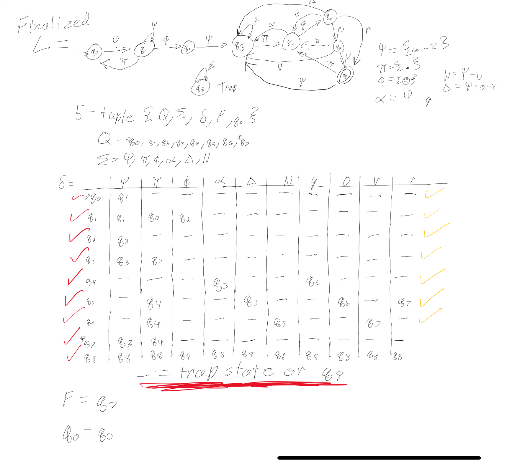

# cs341_email_dfa
CS341 DFA implementation in code
Here is the picture of the DFA:

!dfa_cs341.jpg A DFA for email addresses

On the sides it explains all the inputs that are possible. 

# Thinking and Approach
At first my thought after making the dfa was to use function class to return things but after realizing that would be a horrible idea I switched my implementation. The idea I got this was from my CS280 class which was a more advanced version of this but that is where I decided to use the switch and scanf was told from the project requirements. As for the reason I use the prev variable and designed the switch states with a function call in the middle, it was based on the fact that I had to show what states switched (example: q1 -> q2). So to save on space I used the same variable and just called in-between the print statements to make it print properly, also made the copy and paste for the case easier. 

As for the check functions, those could've been removed for easier readability, however, for phi realizing it would be called so many times I thought it would be better to make them all functions. Instead of removing them I added comments to make it more readable.

# Execution and Output
Now that my files were finally built there was one small problem, inputting manually was going to take too much so I used my WSL system to help with that. Here are the steps I took and how you can modify/replicate them.

Step 1, The input file:
The input file follows a simple procedure, the first line is the number of strings they are going to input, the rest are going to be the email addresses. Look at the input file in the repo for an example

Step 2, Running commands:
Final to run this file compile it first using (note this is only for the way I ran it):

`gcc -o dfa.c whateverYouWantTheNameToBe`

then change the input how you need it to be and run:
`./whateverYouWantTheNameToBe < input > output_dfa.txt`

All output should be in the output_dfa.txt file. If you are wondering what the > or < mean, go look up redirect linux with scanf.